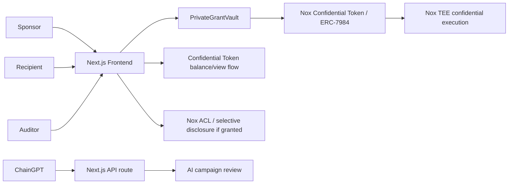

# PrivateGrant Vault

PrivateGrant Vault is a confidential grant, bounty, and payroll payout dApp for Web3 teams, using iExec Nox Confidential Tokens to hide recipient balances and payout amounts while keeping campaign funding and settlement auditable.

The MVP targets Arbitrum Sepolia and uses the Nox TEE-based ERC-7984 stack from `@iexec-nox`. It does not use OpenZeppelin confidential contracts or Zama FHE.

## Why Privacy Matters

Transparent payout rails leak compensation, reward strategy, contributor leverage, and treasury operations. PrivateGrant Vault keeps campaign metadata public while private payout amounts are represented by Nox encrypted handles.

## How It Uses iExec Nox

- Deploys a concrete `NoxERC20ConfidentialWrapper` built from `@iexec-nox/nox-confidential-contracts`.
- Sponsors shield ERC-20 funds through `IERC20ToERC7984Wrapper.wrap`.
- Sponsors authorize `PrivateGrantVault` as an ERC-7984 operator with `setOperator`.
- The frontend encrypts payout amounts with `@iexec-nox/handle`.
- The vault validates encrypted amounts with `Nox.fromExternal`.
- The vault transfers with `IERC7984.confidentialTransferFrom` using the authorized encrypted handle.
- The vault emits only safe payout metadata: campaign id, recipient, confidential token, encrypted handle reference, and public memo.

## Architecture



## Tech Stack

- Next.js 15 App Router, TypeScript, Tailwind CSS
- wagmi, viem, RainbowKit, TanStack Query
- React Hook Form, Zod, Framer Motion-ready UI structure
- Solidity 0.8.28, Hardhat
- iExec Nox packages: `@iexec-nox/nox-protocol-contracts`, `@iexec-nox/nox-confidential-contracts`, `@iexec-nox/handle`
- ChainGPT server-side API route

## Environment

Copy `.env.example` to `.env.local` for frontend work and `.env` for Hardhat scripts:

```bash
NEXT_PUBLIC_CHAIN_ID=421614
NEXT_PUBLIC_PRIVATE_GRANT_VAULT_ADDRESS=
NEXT_PUBLIC_DEFAULT_ERC20_ADDRESS=
NEXT_PUBLIC_DEFAULT_CONFIDENTIAL_TOKEN_ADDRESS=
NEXT_PUBLIC_WALLETCONNECT_PROJECT_ID=
NEXT_PUBLIC_RPC_URL_ARBITRUM_SEPOLIA=https://sepolia-rollup.arbitrum.io/rpc
CHAINGPT_API_KEY=
RPC_URL_ARBITRUM_SEPOLIA=
PRIVATE_KEY=
```

`NEXT_PUBLIC_RPC_URL_ARBITRUM_SEPOLIA` is the browser-facing RPC used by wagmi and RainbowKit.
If your wallet reports `RPC endpoint not found or unavailable`, set this to a working Arbitrum
Sepolia RPC and update the wallet's Arbitrum Sepolia network RPC URL to the same endpoint.

`PRIVATE_KEY` must be a funded Arbitrum Sepolia deployer key. Do not commit it.

## Install

```bash
npm install
```

## Compile and Test

```bash
npm run compile
npm run typecheck
npm run test
npm run build
```

## Deploy to Arbitrum Sepolia

```bash
cp .env.example .env
# fill RPC_URL_ARBITRUM_SEPOLIA and PRIVATE_KEY
npm run deploy:arbitrum-sepolia
```

The deployment script writes `deployments/arbitrumSepolia.json` with:

- `privateGrantVault`
- `testToken`
- `confidentialToken`
- NoxCompute reference address

Set these in `.env.local`:

```bash
NEXT_PUBLIC_PRIVATE_GRANT_VAULT_ADDRESS=<privateGrantVault>
NEXT_PUBLIC_DEFAULT_ERC20_ADDRESS=<testToken>
NEXT_PUBLIC_DEFAULT_CONFIDENTIAL_TOKEN_ADDRESS=<confidentialToken>
```

## Seed Real Demo Transactions

```bash
DEMO_RECIPIENT=0xRecipientWallet DEMO_AUDITOR=0xAuditorWallet npm run seed:arbitrum-sepolia
```

This script creates a real campaign, approves ERC-20, shields funds through the Nox wrapper, authorizes the vault as ERC-7984 operator, encrypts a payout amount with the Nox Handle SDK, and sends a confidential payout.

## Run Frontend

```bash
npm run dev
```

Open `http://localhost:3000`.

## App Pages

- `/` landing page
- `/app` campaign dashboard
- `/app/create` campaign creation
- `/app/campaign/[id]` shield, payout, recipient balance, auditor access
- `/app/recipient` recipient dashboard
- `/app/auditor` auditor dashboard
- `/app/ai-review` ChainGPT assistant

## ChainGPT

The ChainGPT route is server-side at `/api/chaingpt/review`. It calls `POST https://api.chaingpt.org/chat/stream` with `model: "general_assistant"` when `CHAINGPT_API_KEY` is configured. If the key is missing, the UI shows a disabled state and does not fake AI output.

## Demo Recording Plan

Keep the final video under 4 minutes:

1. Explain the privacy problem.
2. Connect wallet on Arbitrum Sepolia.
3. Show real campaign creation.
4. Approve and shield funds.
5. Authorize vault and send encrypted payout.
6. Show recipient balance handle/decrypt flow.
7. Show auditor access and ChainGPT assistant.
8. End with the Nox TEE-based ERC-7984 note.

## Known Limitations

- Viewer revocation is app-level only because the current inspected Nox package exposes `addViewer` and `isViewer`, but not a viewer removal function.
- Public shield amounts are visible because ERC-20 funding and wrapper deposits are public by design.
- The frontend assumes 6 decimals for demo token input formatting. Production token support should read decimals dynamically per campaign before parsing form input.
- Arbitrum mainnet is not enabled because the inspected Nox SDK currently resolves Arbitrum Sepolia and marks mainnet as not deployed.
- If `NEXT_PUBLIC_WALLETCONNECT_PROJECT_ID` is omitted, the app uses injected wallets only. Add a valid project id to enable WalletConnect wallets.

## Roadmap

- Dynamic token decimals in every form.
- Batch payouts with individual encrypted handles.
- Auditor workspace for granted handle decryption.
- Optional IPFS campaign metadata.
- Production deployment on Arbitrum when Nox mainnet address is available.
- CI with contract tests, frontend validation tests, typecheck, and build.

## References

- iExec docs: https://docs.iex.ec
- Nox protocol contracts: https://github.com/iExec-Nox/nox-protocol-contracts
- Nox confidential contracts: https://github.com/iExec-Nox/nox-confidential-contracts
- Nox Handle SDK: https://github.com/iExec-Nox/nox-handle-sdk
- ChainGPT API docs: https://docs.chaingpt.org/dev-docs-b2b-saas-api-and-sdk/web3-ai-chatbot-and-llm-api-and-sdk/api-reference
# private-grant
